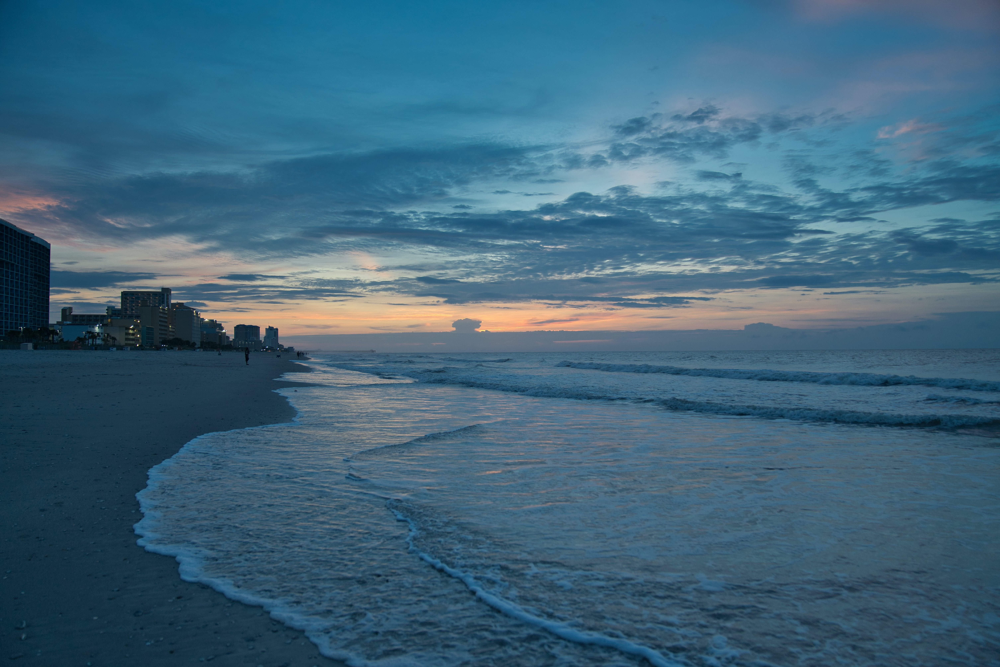

#**Chase McFaddin**

<!-- 

Hey everyone! My name is Chase McFaddin. I was born and raised in small town Kingstree, South Carolina. I went to college in Myrtle Beach where I graduated with a Bachelor of Science in Recreation & Sport Management. I've worked in various different sales jobs for the last decade. Recently, I decided it was time for a change and have moved across the country to outside of the Seattle area to attend Code Fellows. My goal is to become a software developer and look forward to this new journey, which will hopefully be as rewarding as it is challenging. My hobbies include fantasy sports, video games, hiking and kayaking, watching lots of television and listening to podcasts.

You can connect with me here:

Linkedin: 
  
  

<!--
**ChaseMcFaddin/ChaseMcFaddin** is a ✨ _special_ ✨ repository because its `README.md` (this file) appears on your GitHub profile.

